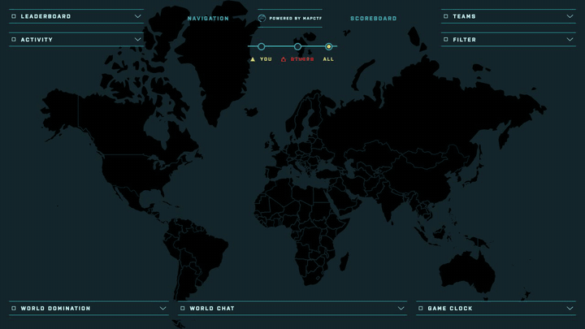

# mapctf.com

  
  

    Cyber range platform with a map-based UI
  

Static site for [mapctf.com](https://mapctf.com)

  

## Serve Locally

To see how the website will look like before submitting your changes, you can serve it locally. Using the `Makefile` issue the command `make serve` and the website will be generated and served locally using `npx http-server`.
